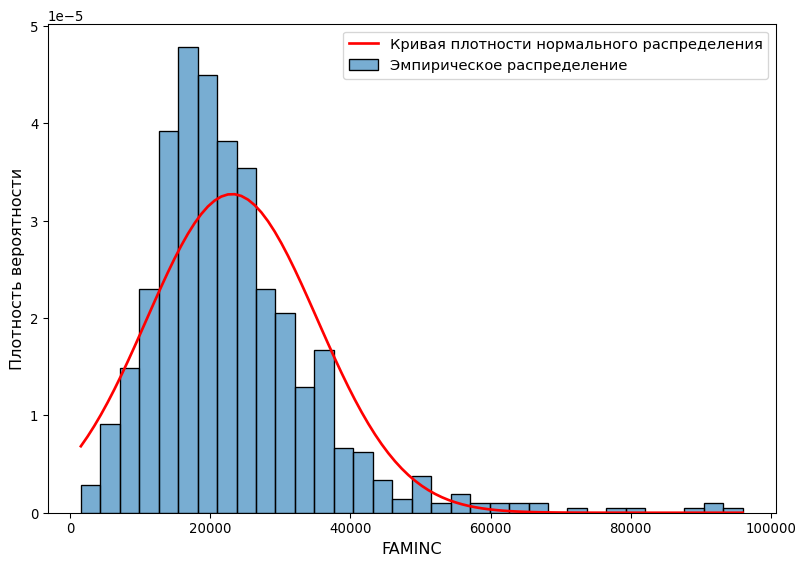
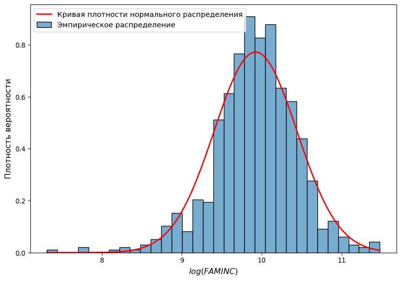
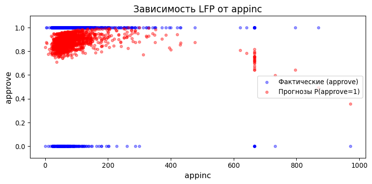
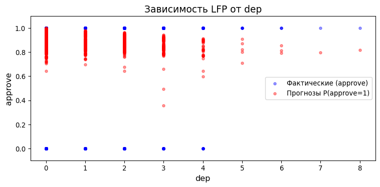
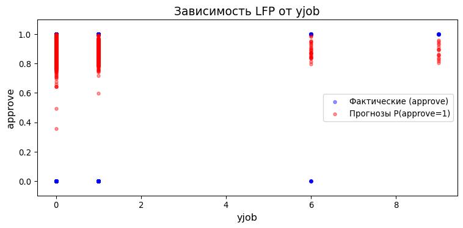
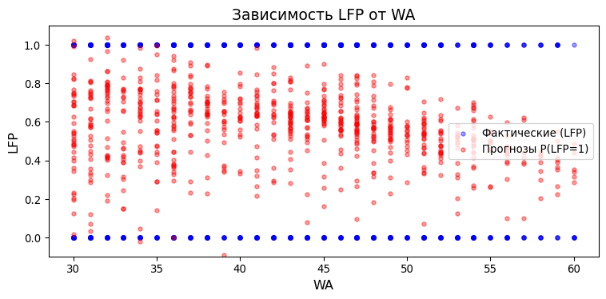
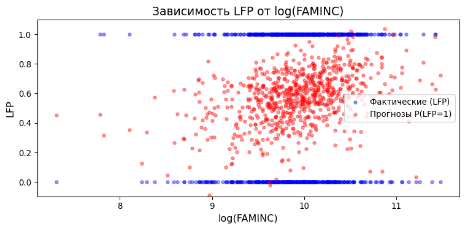
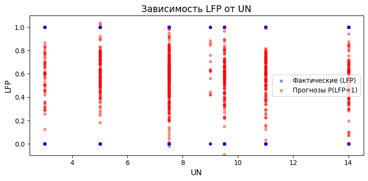

# Задачи по Эконометрике-2: LPM-модель
Н.В. Артамонов, А. Н. Лата (МГИМО МИД России)

- [Подгонка модели](#подгонка-модели)
  - [approve equation \#1](#approve-equation-1)
  - [approve equation \#2](#approve-equation-2)
  - [labour force equation \#1](#labour-force-equation-1)
  - [labour force equation \#2](#labour-force-equation-2)
  - [Замечание: почему log(FAMINC)](#замечание-почему-logfaminc)
- [t-тест](#t-тест)
  - [approve equation \#1](#approve-equation-1-1)
  - [approve equation \#2](#approve-equation-2-1)
  - [labour force equation \#1](#labour-force-equation-1-1)
  - [labour force equation \#2](#labour-force-equation-2-1)
- [F-тест: значимость регрессии](#f-тест-значимость-регрессии)
  - [approve equation \#1](#approve-equation-1-2)
  - [approve equation \#2](#approve-equation-2-2)
  - [approve equation \#3](#approve-equation-3)
- [F-тест: совместная значимость](#f-тест-совместная-значимость)
  - [approve equation \#1](#approve-equation-1-3)
    - [Гипотеза 1: значимость влияния
      дохода](#гипотеза-1-значимость-влияния-дохода)
    - [Гипотеза 2: совместная значимость unem, dep,
      married](#гипотеза-2-совместная-значимость-unem-dep-married)
- [Прогноз](#прогноз)
  - [approve equation](#approve-equation)
  - [labour force equation](#labour-force-equation)
- [Вопросы адекватности модели](#вопросы-адекватности-модели)
  - [approve equation](#approve-equation-4)
    - [Анализ переменной `appinc`](#анализ-переменной-appinc)
    - [Анализ переменной `dep`](#анализ-переменной-dep)
    - [Анализ переменной `yjob`](#анализ-переменной-yjob)
  - [labour force equation](#labour-force-equation-3)
    - [Анализ переменной `WA`](#анализ-переменной-wa)
    - [Анализ переменной `log(FAMINC)`](#анализ-переменной-logfaminc)
    - [Анализ переменной `UN`](#анализ-переменной-un)

# Подгонка модели

## approve equation \#1

Для датасета `loanapp` рассмотрим регрессию **approve на mortno, unem,
dep, male, married, yjob, self**

Спецификация:

$$\begin{equation}
approve=\beta_0 + \beta_1 mortno+\beta_2 unem + \beta_3 dep + \beta_4 male + \beta_5 married + \beta_6 yjob + \beta_7 self + u
\end{equation}$$

Альтернативная спецификация:

$$\begin{equation}
P(approve=1)=\beta_0+\beta_1mortno+\beta_2unem+\beta_3dep+\beta_4male+\beta_5married+\beta_6yjob+\beta_7self
\end{equation}$$

Оцените модель на данных и укажите коэффициенты подогнанной модели.
**Ответ округлите до 3-х десятичных знаков.**

Ответ:

| Переменная | Оценка (OLS) | Оценка (HC3) |
|:-----------|-------------:|-------------:|
| Intercept  |        0.864 |        0.864 |
| mortno     |        0.073 |        0.073 |
| unem       |       -0.006 |       -0.006 |
| dep        |       -0.018 |       -0.018 |
| male       |        0.002 |        0.002 |
| married    |        0.046 |        0.046 |
| yjob       |       -0.001 |       -0.001 |
| self       |       -0.036 |       -0.036 |

**Дайте интерпретацию коэффициентам модели.**

## approve equation \#2

Для датасета `loanapp` рассмотрим регрессию **approve на appinc,
I(appinc \*\* 2), mortno, unem, dep, male, married, yjob, self**

Спецификация:

$$\begin{equation}
approve=\beta_0 + \beta_1 appinc + \beta_2 appinc^{2} + \beta_3 mortno+\beta_4 unem + \beta_5 dep + \beta_6 male + \beta_7 married + \beta_8 yjob + \beta_9 self + u
\end{equation}$$

Альтернативная спецификация:

$$\begin{equation}
P(approve=1)=\beta_0 + \beta_1 appinc + \beta_2 appinc^{2} + \beta_3 mortno+\beta_4 unem + \beta_5 dep + \beta_6 male + \beta_7 married + \beta_8 yjob + \beta_9 self
\end{equation}$$

Оцените модель на данных и укажите коэффициенты подогнанной модели.
**Ответ округлите до 3-х десятичных знаков.**

Ответ:

| Переменная       | Оценка (OLS) | Оценка (HC3) |
|:-----------------|-------------:|-------------:|
| Intercept        |        0.842 |        0.842 |
| appinc           |        0.001 |        0.001 |
| I(appinc \*\* 2) |           -0 |           -0 |
| mortno           |        0.066 |        0.066 |
| unem             |       -0.006 |       -0.006 |
| dep              |       -0.017 |       -0.017 |
| male             |       -0.003 |       -0.003 |
| married          |        0.043 |        0.043 |
| yjob             |       -0.001 |       -0.001 |
| self             |        -0.04 |        -0.04 |

**Дайте интерпретацию коэффициентам модели.**

## labour force equation \#1

Для датасета `TableF5-1` рассмотрим регрессию **LFP на WA, I(WA \*\* 2),
WE, KL6, K618, CIT, UN, np.log(FAMINC)**

Спецификация:

$$\begin{equation}
LFP=\beta_0+\beta_1WA+\beta_2WA^2+\beta_3WE+\beta_4KL6+\beta_5K618+\beta_6CIT+\beta_7UN+\beta_8\log(FAMINC)+u
\end{equation}$$

Альтернативная спецификация:

$$\begin{equation}
P(LFP=1)=\beta_0+\beta_1WA+\beta_2WA^2+\beta_3WE+\beta_4KL6+\beta_5K618+\beta_6CIT+\beta_7UN+\beta_8\log(FAMINC)
\end{equation}$$

Оцените модель на данных и укажите коэффициенты подогнанной модели.
**Ответ округлите до 3-х десятичных знаков.**

Ответ:

| Переменная     | Оценка (OLS) | Оценка (HC3) |
|:---------------|-------------:|-------------:|
| Intercept      |       -0.321 |       -0.321 |
| WA             |        0.008 |        0.008 |
| I(WA \*\* 2)   |           -0 |           -0 |
| WE             |        0.038 |        0.038 |
| KL6            |       -0.296 |       -0.296 |
| K618           |       -0.021 |       -0.021 |
| CIT            |       -0.048 |       -0.048 |
| UN             |       -0.004 |       -0.004 |
| np.log(FAMINC) |        0.072 |        0.072 |

**Дайте интерпретацию коэффициентам модели.**

## labour force equation \#2

Для датасета `TableF5-1` рассмотрим регрессию **LFP на WA, WE, CIT, UN,
np.log(FAMINC)**

Спецификация:

$$\begin{equation}
LFP = \beta_0 + \beta_1 WA + \beta_2 WE + \beta_3 CIT + \beta_4 CIT+\beta_5 UN + \beta_6 \log(FAMINC)+u
\end{equation}$$

Альтернативная спецификация:

$$\begin{equation}
P(LFP=1) = \beta_0 + \beta_1 WA + \beta_2 WE + \beta_3 CIT + \beta_4 CIT+\beta_5 UN + \beta_6 \log(FAMINC)
\end{equation}$$

Оцените модель на данных и укажите коэффициенты подогнанной модели.
**Ответ округлите до 3-х десятичных знаков.**

Ответ:

| Переменная     | Оценка (OLS) | Оценка (HC3) |
|:---------------|-------------:|-------------:|
| Intercept      |       -0.536 |       -0.536 |
| WA             |       -0.004 |       -0.004 |
| WE             |        0.033 |        0.033 |
| CIT            |       -0.048 |       -0.048 |
| UN             |       -0.005 |       -0.005 |
| np.log(FAMINC) |        0.094 |        0.094 |

**Дайте интерпретацию коэффициентам модели.**

## Замечание: почему log(FAMINC)

Нарисуем гистограмму $\textrm{FAMINC}$ с наложенной кривой нормального
распределения

Рисунок 1: Гистограмма распределения дохода семьи ($\textrm{FAMINC}$) с
наложением нормальной кривой плотности.

Нарисуем гистограмму $\log(\textrm{FAMINC})$ с наложенной кривой
нормального распределения

Рисунок 2: Гистограмма логарифмированного дохода семьи с наложением
нормальной кривой плотности.

# t-тест

## approve equation \#1

Для датасета `loanapp` рассмотрим регрессию **approve на mortno, unem,
dep, male, married, yjob, self**

Оцените модель на данных и укажите (робастные) коэффициенты подогнанной
модели. **Ответ округлите до 3-х десятичных знаков.**

Ответ:

| Переменная | Оценка (HC3) |
|:-----------|-------------:|
| Intercept  |        0.864 |
| mortno     |        0.073 |
| unem       |       -0.006 |
| dep        |       -0.018 |
| male       |        0.002 |
| married    |        0.046 |
| yjob       |       -0.001 |
| self       |       -0.036 |

Модель была подогнана по 1971 наблюдению.
Уровень значимости 1%

Вычислите критическое значения для $t$-теста. **Ответ округлите до 3-х
десятичных знаков.**

> [!NOTE]
>
> ### Критическое значение
>
> $t_{crit} = 2.578$

**Укажите результаты робастного и неробастного $t$-теста. Ответ
округлите до 3-х десятичных знаков.**

**Результаты $t$-теста для коэффициентов (неробастные стандартные
ошибки, s.e.)**

|           |  Coef. | Std.Err. | t-value | p-value | Signif. |
|:----------|-------:|---------:|--------:|--------:|:--------|
| Intercept |  0.864 |    0.022 |  39.444 |       0 |         |
| mortno    |  0.073 |    0.016 |   4.578 |       0 | \*\*\*  |
| unem      | -0.006 |    0.003 |  -1.858 |   0.063 | \*      |
| dep       | -0.018 |    0.007 |   -2.57 |    0.01 | \*\*    |
| male      |  0.002 |     0.02 |   0.094 |   0.925 |         |
| married   |  0.046 |    0.018 |   2.604 |   0.009 | \*\*\*  |
| yjob      | -0.001 |    0.007 |  -0.099 |   0.921 |         |
| self      | -0.036 |    0.022 |  -1.621 |   0.105 |         |

*Signif. codes:* `***` $p<0.01$, `**` $p<0.05$, `*` $p<0.1$

Какие коэффициенты значимы?

> [!NOTE]
>
> ### Коэффициенты, значимые на уровне 1% (по классическим стандартным ошибкам)
>
> `mortno`, `married`

**Результаты $t$-теста для коэффициентов (робастные стандартные ошибки,
HC3-s.e.):**

|           |  Coef. | Std.Err. | t-value | p-value | Signif. |
|:----------|-------:|---------:|--------:|--------:|:--------|
| Intercept |  0.864 |    0.023 |  37.135 |       0 |         |
| mortno    |  0.073 |    0.015 |   4.886 |       0 | \*\*\*  |
| unem      | -0.006 |    0.004 |  -1.605 |   0.108 |         |
| dep       | -0.018 |    0.008 |  -2.429 |   0.015 | \*\*    |
| male      |  0.002 |    0.021 |   0.089 |   0.929 |         |
| married   |  0.046 |    0.019 |   2.458 |   0.014 | \*\*    |
| yjob      | -0.001 |    0.006 |  -0.107 |   0.915 |         |
| self      | -0.036 |    0.025 |  -1.464 |   0.143 |         |

*Signif. codes:* `***` $p<0.01$, `**` $p<0.05$, `*` $p<0.1$

Какие коэффициенты значимы?

> [!NOTE]
>
> ### Коэффициенты, значимые на уровне 1% (по робастным стандартным ошибкам HC3)
>
> `mortno`

> [!NOTE]
>
> ### Расшифровка кодов статистической значимости (Signif. codes)
>
> В таблицах регрессионного анализа звездочками традиционно обозначается
> $p$-значение (p-value) для каждого коэффициента. Чем меньше
> $p$-значение, тем сильнее статистические доказательства против нулевой
> гипотезы ($H_0$), согласно которой данный фактор не влияет на
> зависимую переменную (истинный коэффициент равен нулю).
>
> - `***` : **$p < 0.01$** (от 0 до 0.01) — *высокая значимость*.
>   Нулевая гипотеза отвергается на уровне значимости 1%.
> - `**` : **$0.01 \le p < 0.05$** — *стандартная значимость*.
>   Коэффициент значим на 5% уровне. Это самый распространенный порог
>   для подтверждения гипотез в большинстве исследований.
> - `*` : **$0.05 \le p < 0.1$** — *маргинальная (слабая) значимость*.
>   Коэффициент значим лишь на 10% уровне. В строгих моделях предиктор
>   признают незначимым, но иногда интерпретируют как «статистическую
>   тенденцию».
> - `` (пустое место) : **$p \ge 0.1$** (от 0.1 до 1) — *статистически
>   не значимо*. У нас нет достаточных оснований утверждать, что
>   переменная оказывает влияние на результат.

## approve equation \#2

Для датасета `loanapp` рассмотрим регрессию **approve на appinc,
I(appinc \*\* 2), mortno, unem, dep, male, married, yjob, self**

Оцените модель на данных и укажите (робастные) коэффициенты подогнанной
модели. **Ответ округлите до 3-х десятичных знаков.**

Ответ:

| Переменная       | Оценка (HC3) |
|:-----------------|-------------:|
| Intercept        |        0.842 |
| appinc           |        0.001 |
| I(appinc \*\* 2) |           -0 |
| mortno           |        0.066 |
| unem             |       -0.006 |
| dep              |       -0.017 |
| male             |       -0.003 |
| married          |        0.043 |
| yjob             |       -0.001 |
| self             |        -0.04 |

Модель была подогнана по 1971 наблюдению.
Уровень значимости 1%

Вычислите критическое значения для $t$-теста. **Ответ округлите до 3-х
десятичных знаков.**

Ответ:

> [!NOTE]
>
> ### Критическое значение
>
> $t_{crit} = 2.578$

**Укажите результаты робастного и неробастного $t$-теста. Ответ
округлите до 3-х десятичных знаков.**

**Результаты $t$-теста для коэффициентов (неробастные стандартные
ошибки, s.e.)**

|                  |  Coef. | Std.Err. | t-value | p-value | Signif. |
|:-----------------|-------:|---------:|--------:|--------:|:--------|
| Intercept        |  0.842 |    0.025 |    33.3 |       0 |         |
| appinc           |  0.001 |        0 |   2.082 |   0.037 | \*\*    |
| I(appinc \*\* 2) |     -0 |        0 |  -2.803 |   0.005 | \*\*\*  |
| mortno           |  0.066 |    0.016 |   4.029 |       0 | \*\*\*  |
| unem             | -0.006 |    0.003 |  -1.757 |   0.079 | \*      |
| dep              | -0.017 |    0.007 |  -2.374 |   0.018 | \*\*    |
| male             | -0.003 |     0.02 |  -0.142 |   0.887 |         |
| married          |  0.043 |    0.018 |   2.449 |   0.014 | \*\*    |
| yjob             | -0.001 |    0.007 |  -0.132 |   0.895 |         |
| self             |  -0.04 |    0.023 |  -1.786 |   0.074 | \*      |

*Signif. codes:* `***` $p<0.01$, `**` $p<0.05$, `*` $p<0.1$

Какие коэффициенты значимы?

> [!NOTE]
>
> ### Коэффициенты, значимые на уровне 1% (по классическим стандартным ошибкам)
>
> `I(appinc ** 2)`, `mortno`

**Результаты $t$-теста для коэффициентов (робастные стандартные ошибки,
HC3-s.e.):**

|                  |  Coef. | Std.Err. | t-value | p-value | Signif. |
|:-----------------|-------:|---------:|--------:|--------:|:--------|
| Intercept        |  0.842 |    0.027 |  31.003 |       0 |         |
| appinc           |  0.001 |        0 |   1.958 |    0.05 | \*      |
| I(appinc \*\* 2) |     -0 |        0 |  -2.374 |   0.018 | \*\*    |
| mortno           |  0.066 |    0.015 |   4.321 |       0 | \*\*\*  |
| unem             | -0.006 |    0.004 |  -1.515 |    0.13 |         |
| dep              | -0.017 |    0.007 |   -2.28 |   0.023 | \*\*    |
| male             | -0.003 |    0.021 |  -0.135 |   0.893 |         |
| married          |  0.043 |    0.019 |   2.309 |   0.021 | \*\*    |
| yjob             | -0.001 |    0.006 |   -0.14 |   0.889 |         |
| self             |  -0.04 |    0.025 |  -1.602 |   0.109 |         |

*Signif. codes:* `***` $p<0.01$, `**` $p<0.05$, `*` $p<0.1$

Какие коэффициенты значимы?

> [!NOTE]
>
> ### Коэффициенты, значимые на уровне 1% (по робастным стандартным ошибкам HC3)
>
> `mortno`

## labour force equation \#1

Для датасета `TableF5-1` рассмотрим регрессию **LFP на WA, I(WA \*\* 2),
WE, KL6, K618, CIT, UN, np.log(FAMINC)**

Оцените модель на данных и укажите (робастные) коэффициенты подогнанной
модели. **Ответ округлите до 3-х десятичных знаков.**

Ответ:

| Переменная     | Оценка (HC3) |
|:---------------|-------------:|
| Intercept      |       -0.321 |
| WA             |        0.008 |
| I(WA \*\* 2)   |           -0 |
| WE             |        0.038 |
| KL6            |       -0.296 |
| K618           |       -0.021 |
| CIT            |       -0.048 |
| UN             |       -0.004 |
| np.log(FAMINC) |        0.072 |

Модель была подогнана по 753 наблюдению.
Уровень значимости 1%

Вычислите критическое значения для $t$-теста. **Ответ округлите до 3-х
десятичных знаков.**

Ответ:

> [!NOTE]
>
> ### Критическое значение
>
> $t_{crit} = 2.582$

**Укажите результаты робастного и неробастного $t$-теста. Ответ
округлите до 3-х десятичных знаков.**

**Результаты $t$-теста для коэффициентов (неробастные стандартные
ошибки, s.e.)**

|                |  Coef. | Std.Err. | t-value | p-value | Signif. |
|:---------------|-------:|---------:|--------:|--------:|:--------|
| Intercept      | -0.321 |    0.592 |  -0.542 |   0.588 |         |
| WA             |  0.008 |    0.025 |   0.305 |    0.76 |         |
| I(WA \*\* 2)   |     -0 |        0 |  -0.847 |   0.398 |         |
| WE             |  0.038 |    0.008 |   4.574 |       0 | \*\*\*  |
| KL6            | -0.296 |    0.037 |  -8.011 |       0 | \*\*\*  |
| K618           | -0.021 |    0.015 |  -1.434 |   0.152 |         |
| CIT            | -0.048 |    0.038 |  -1.283 |     0.2 |         |
| UN             | -0.004 |    0.006 |  -0.647 |   0.518 |         |
| np.log(FAMINC) |  0.072 |    0.037 |   1.965 |    0.05 | \*\*    |

*Signif. codes:* `***` $p<0.01$, `**` $p<0.05$, `*` $p<0.1$

Какие коэффициенты значимы?

> [!NOTE]
>
> ### Коэффициенты, значимые на уровне 1% (по классическим стандартным ошибкам)
>
> `WE`, `KL6`

**Результаты $t$-теста для коэффициентов (робастные стандартные ошибки,
HC3-s.e.):**

|                |  Coef. | Std.Err. | t-value | p-value | Signif. |
|:---------------|-------:|---------:|--------:|--------:|:--------|
| Intercept      | -0.321 |    0.585 |  -0.549 |   0.583 |         |
| WA             |  0.008 |    0.024 |   0.307 |   0.759 |         |
| I(WA \*\* 2)   |     -0 |        0 |  -0.843 |   0.399 |         |
| WE             |  0.038 |    0.008 |   4.736 |       0 | \*\*\*  |
| KL6            | -0.296 |    0.034 |  -8.763 |       0 | \*\*\*  |
| K618           | -0.021 |    0.015 |  -1.409 |   0.159 |         |
| CIT            | -0.048 |    0.037 |    -1.3 |   0.193 |         |
| UN             | -0.004 |    0.006 |  -0.633 |   0.527 |         |
| np.log(FAMINC) |  0.072 |    0.038 |   1.921 |   0.055 | \*      |

*Signif. codes:* `***` $p<0.01$, `**` $p<0.05$, `*` $p<0.1$

Какие коэффициенты значимы?

> [!NOTE]
>
> ### Коэффициенты, значимые на уровне 1% (по робастным стандартным ошибкам HC3)
>
> `WE`, `KL6`

## labour force equation \#2

Для датасета `TableF5-1` рассмотрим регрессию **LFP на WA, WE, CIT, UN,
np.log(FAMINC)**

Оцените модель на данных и укажите (робастные) коэффициенты подогнанной
модели. **Ответ округлите до 3-х десятичных знаков.**

Ответ:

| Переменная     | Оценка (HC3) |
|:---------------|-------------:|
| Intercept      |       -0.536 |
| WA             |       -0.004 |
| WE             |        0.033 |
| CIT            |       -0.048 |
| UN             |       -0.005 |
| np.log(FAMINC) |        0.094 |

Модель была подогнана по 753 наблюдению.
Уровень значимости 5%

Вычислите критическое значения для $t$-теста. **Ответ округлите до 3-х
десятичных знаков.**

> [!NOTE]
>
> ### Критическое значение
>
> $t_{crit} = 1.963$

**Укажите результаты робастного и неробастного $t$-теста. Ответ
округлите до 3-х десятичных знаков.**

**Результаты $t$-теста для коэффициентов (неробастные стандартные
ошибки, s.e.)**

|                |  Coef. | Std.Err. | t-value | p-value | Signif. |
|:---------------|-------:|---------:|--------:|--------:|:--------|
| Intercept      | -0.536 |     0.36 |  -1.488 |   0.137 |         |
| WA             | -0.004 |    0.002 |  -1.668 |   0.096 | \*      |
| WE             |  0.033 |    0.009 |   3.914 |       0 | \*\*\*  |
| CIT            | -0.048 |    0.039 |  -1.217 |   0.224 |         |
| UN             | -0.005 |    0.006 |  -0.868 |   0.386 |         |
| np.log(FAMINC) |  0.094 |    0.038 |   2.449 |   0.015 | \*\*    |

*Signif. codes:* `***` $p<0.01$, `**` $p<0.05$, `*` $p<0.1$

Какие коэффициенты значимы?

> [!NOTE]
>
> ### Коэффициенты, значимые на уровне 5% (по классическим стандартным ошибкам)
>
> `WE`, `np.log(FAMINC)`

**Результаты $t$-теста для коэффициентов (робастные стандартные ошибки,
HC3-s.e.):**

|                |  Coef. | Std.Err. | t-value | p-value | Signif. |
|:---------------|-------:|---------:|--------:|--------:|:--------|
| Intercept      | -0.536 |    0.368 |  -1.457 |   0.145 |         |
| WA             | -0.004 |    0.002 |  -1.635 |   0.102 |         |
| WE             |  0.033 |    0.008 |   4.036 |       0 | \*\*\*  |
| CIT            | -0.048 |    0.039 |  -1.212 |   0.226 |         |
| UN             | -0.005 |    0.006 |  -0.855 |   0.392 |         |
| np.log(FAMINC) |  0.094 |     0.04 |   2.351 |   0.019 | \*\*    |

*Signif. codes:* `***` $p<0.01$, `**` $p<0.05$, `*` $p<0.1$

Какие коэффициенты значимы?

> [!NOTE]
>
> ### Коэффициенты, значимые на уровне 5% (по робастным стандартным ошибкам HC3)
>
> `WE`, `np.log(FAMINC)`

# F-тест: значимость регрессии

## approve equation \#1

Для датасета `loanapp` рассмотрим регрессию **approve на unem, male,
yjob, self**

Результаты оценивания:

|                | approve (OLS) | approve (HC3) |
|:---------------|:--------------|:--------------|
| unem           | -0.007\*\*    | -0.007\*      |
|                | (0.003)       | (0.004)       |
| male           | 0.021         | 0.021         |
|                | (0.019)       | (0.020)       |
| yjob           | 0.001         | 0.001         |
|                | (0.007)       | (0.006)       |
| self           | -0.030        | -0.030        |
|                | (0.022)       | (0.025)       |
| Intercept      | 0.891\*\*\*   | 0.891\*\*\*   |
|                | (0.021)       | (0.023)       |
| R-squared      | 0.004         | 0.004         |
| R-squared Adj. | 0.002         | 0.002         |

*Signif. codes:* \*\*\* $p<0.01$, \*\* $p<0.05$, \* $p<0.1$

Зафиксируем уровень значимости 10%.

Тестируется значимость регрессии, т.е. гипотеза
$H_0:\beta_{unem}=\beta_{male}=\beta_{yjob}=\beta_{self}=0$.

Вычислите критическое значение для гипотезы. **Ответ округлите до 3-х
десятичных знаков.**

> [!NOTE]
>
> ### Критическое значение
>
> $F_{crit} = 1.948$

Получите результаты неробастного F-теста. **Ответ округлите до 3-х
десятичных знаков.**

| F-statistic | Prob(F-statistic) |
|------------:|------------------:|
|       2.011 |              0.09 |

Какой можно сделать вывод?

> [!TIP]
>
> ### Вывод
>
> Регрессия **значима**.

Получите результаты робастного F-теста. **Ответ округлите до 3-х
десятичных знаков.**

| F-statistic | Prob(F-statistic) |
|------------:|------------------:|
|       1.667 |             0.155 |

Какой можно сделать вывод?

> [!IMPORTANT]
>
> ### Вывод
>
> Регрессия **незначима**.

## approve equation \#2

Для датасета `loanapp` рассмотрим регрессию **approve на appinc,
I(appinc \*\* 2), mortno, dep**

|                  | OLS          | HC3         |
|:-----------------|:-------------|:------------|
| unem             | -0.007\*\*   | -0.007\*    |
|                  | (0.003)      | (0.004)     |
| Intercept        | 0.856\*\*\*  | 0.856\*\*\* |
|                  | (0.022)      | (0.023)     |
| appinc           | 0.000\*\*    | 0.000\*\*   |
|                  | (0.000)      | (0.000)     |
| I(appinc \*\* 2) | -0.000\*\*\* | -0.000\*\*  |
|                  | (0.000)      | (0.000)     |
| mortno           | 0.066\*\*\*  | 0.066\*\*\* |
|                  | (0.016)      | (0.015)     |
| R-squared        | 0.019        | 0.019       |
| R-squared Adj.   | 0.017        | 0.017       |

*Signif. codes:* \*\*\* $p<0.01$, \*\* $p<0.05$, \* $p<0.1$

Зафиксируем уровень значимости 5%.

Тестируется значимость регрессии, т.е. гипотеза
$H_0:\beta_{appinc}=\beta_{appinc^2}=\beta_{mortno}=\beta_{dep}=0$.

Вычислите критическое значение для гипотезы. **Ответ округлите до 3-х
десятичных знаков.**

> [!NOTE]
>
> ### Критическое значение
>
> $F_{crit} = 2.376$

Получите результаты неробастного F-теста. **Ответ округлите до 3-х
десятичных знаков.**

| F-statistic | Prob(F-statistic) |
|------------:|------------------:|
|       9.606 |                 0 |

Какой можно сделать вывод?

> [!TIP]
>
> ### Вывод
>
> Регрессия **значима**.

Получите результаты робастного F-теста. **Ответ округлите до 3-х
десятичных знаков.**

| F-statistic | Prob(F-statistic) |
|------------:|------------------:|
|        9.13 |                 0 |

Какой можно сделать вывод?

> [!TIP]
>
> ### Вывод
>
> Регрессия **значима**.

## approve equation \#3

Для датасета `loanapp` рассмотрим регрессию **approve на dep, male,
married**

|                | OLS         | HC3         |
|:---------------|:------------|:------------|
| dep            | -0.016\*\*  | -0.016\*\*  |
|                | (0.007)     | (0.008)     |
| male           | -0.002      | -0.002      |
|                | (0.020)     | (0.021)     |
| married        | 0.057\*\*\* | 0.057\*\*\* |
|                | (0.018)     | (0.019)     |
| Intercept      | 0.852\*\*\* | 0.852\*\*\* |
|                | (0.018)     | (0.019)     |
| R-squared      | 0.006       | 0.006       |
| R-squared Adj. | 0.005       | 0.005       |

*Signif. codes:* \*\*\* $p<0.01$, \*\* $p<0.05$, \* $p<0.1$

Зафиксируем уровень значимости 1%.

Тестируется значимость регрессии, т.е. гипотеза
$H_0:\beta_{dep}=\beta_{male}=\beta_{married}=0$.

Вычислите критическое значение для гипотезы. **Ответ округлите до 3-х
десятичных знаков.**

> [!NOTE]
>
> ### Критическое значение
>
> $F_{crit} = 3.792$

Получите результаты неробастного F-теста. **Ответ округлите до 3-х
десятичных знаков.**

| F-statistic | Prob(F-statistic) |
|------------:|------------------:|
|       4.155 |             0.006 |

Какой можно сделать вывод?

> [!TIP]
>
> ### Вывод
>
> Регрессия **значима**.

Получите результаты робастного F-теста. **Ответ округлите до 3-х
десятичных знаков.**

| F-statistic | Prob(F-statistic) |
|------------:|------------------:|
|       3.724 |             0.011 |

Какой можно сделать вывод?

> [!IMPORTANT]
>
> ### Вывод
>
> Регрессия **незначима**.

# F-тест: совместная значимость

## approve equation \#1

Для датасета `loanapp` рассмотрим регрессию **approve на appinc,
I(appinc \*\* 2), mortno, unem, dep, male, married, yjob, self**

|                  | Model 1     | Model 2     | Model 3      |
|:-----------------|:------------|:------------|:-------------|
| Dep. Variable    | approve     | approve     | approve      |
| appinc           | 0.001\*     |             | 0.001\*\*    |
|                  | (0.000)     |             | (0.000)      |
| I(appinc \*\* 2) | -0.000\*\*  |             | -0.000\*\*\* |
|                  | (0.000)     |             | (0.000)      |
| mortno           | 0.066\*\*\* | 0.073\*\*\* | 0.067\*\*\*  |
|                  | (0.015)     | (0.015)     | (0.015)      |
| unem             | -0.006      | -0.006      |              |
|                  | (0.004)     | (0.004)     |              |
| dep              | -0.017\*\*  | -0.018\*\*  |              |
|                  | (0.007)     | (0.008)     |              |
| male             | -0.003      | 0.002       | 0.003        |
|                  | (0.021)     | (0.021)     | (0.020)      |
| married          | 0.043\*\*   | 0.046\*\*   |              |
|                  | (0.019)     | (0.019)     |              |
| yjob             | -0.001      | -0.001      | -0.000       |
|                  | (0.006)     | (0.006)     | (0.006)      |
| self             | -0.040      | -0.036      | -0.050\*\*   |
|                  | (0.025)     | (0.025)     | (0.024)      |
| Intercept        | 0.842\*\*\* | 0.864\*\*\* | 0.824\*\*\*  |
|                  | (0.027)     | (0.023)     | (0.023)      |
| R-squared        | 0.025       | 0.020       | 0.019        |
| R-squared Adj.   | 0.021       | 0.017       | 0.016        |
| F-statistic      | 5.032       | 5.849       | 6.172        |
| Nobs             | 1971        | 1971        | 1971         |

*Signif. codes:* \*\*\* $p<0.01$, \*\* $p<0.05$, \* $p<0.1$

### Гипотеза 1: значимость влияния дохода

Тестируется значимость влияния дохода, т.е. гипотеза
$H_0:\beta_{appinc}=\beta_{appinc^2}=0$.

Зафиксируем уровень значимости 5%.

Вычислите критическое значение для гипотезы. **Ответ округлите до 3-х
десятичных знаков.**

> [!NOTE]
>
> ### Критическое значение
>
> $F_{crit} = 3.000$

Получите результаты неробастного F-теста. **Ответ округлите до 3-х
десятичных знаков.**

| F-statistic | Prob(F-statistic) |
|------------:|------------------:|
|       5.149 |             0.006 |

Какой можно сделать вывод?

> [!TIP]
>
> ### Вывод
>
> Гипотеза **отвергается**.

Получите результаты робастного F-теста. **Ответ округлите до 3-х
десятичных знаков.**

| F-statistic | Prob(F-statistic) |
|------------:|------------------:|
|       2.961 |             0.052 |

Какой можно сделать вывод?

> [!IMPORTANT]
>
> ### Вывод
>
> Гипотеза **не отвергается**.

### Гипотеза 2: совместная значимость unem, dep, married

Тестируется совместная значимость `unem`, `dep` и `married`, т.е.
гипотеза $H_0:\beta_{unem}=\beta_{dep}=\beta_{married}=0$.

Зафиксируем уровень значимости 1%.

Вычислите критическое значение для гипотезы. **Ответ округлите до 3-х
десятичных знаков.**

> [!NOTE]
>
> ### Критическое значение
>
> $F_{crit} = 3.792$

Получите результаты неробастного F-теста. **Ответ округлите до 3-х
десятичных знаков.**

| F-statistic | Prob(F-statistic) |
|------------:|------------------:|
|       4.054 |             0.007 |

Какой можно сделать вывод?

> [!TIP]
>
> ### Вывод
>
> Гипотеза **отвергается** — переменные **значимы совместно**.

Получите результаты робастного F-теста. **Ответ округлите до 3-х
десятичных знаков.**

| F-statistic | Prob(F-statistic) |
|------------:|------------------:|
|       3.469 |             0.016 |

Какой можно сделать вывод?

> [!IMPORTANT]
>
> ### Вывод
>
> Гипотеза **не отвергается** — переменные **незначимы совместно**.

# Прогноз

## approve equation

Для датасета `loanapp` рассмотрим регрессию **approve на mortno, unem,
dep, married**

|                | approve (HC3) |
|:---------------|:--------------|
| mortno         | 0.071\*\*\*   |
|                | (0.015)       |
| unem           | -0.007\*      |
|                | (0.004)       |
| dep            | -0.019\*\*    |
|                | (0.008)       |
| married        | 0.046\*\*\*   |
|                | (0.018)       |
| Intercept      | 0.865\*\*\*   |
|                | (0.020)       |
| R-squared      | 0.019         |
| R-squared Adj. | 0.017         |
| Nobs           | 1971          |
| F-stat         | 9.475         |
| Prob(F-stat)   | 0.000         |

*Signif. codes:* \*\*\* $p<0.01$, \*\* $p<0.05$, \* $p<0.1$

Рассмотрим трех людей с характеристиками

| Человек | mortno | unem | dep | married |
|--------:|-------:|-----:|----:|--------:|
|       1 |      1 |  3.2 |   0 |       1 |
|       2 |      1 |  3.9 |   1 |       0 |
|       3 |      0 |  1.8 |   0 |       1 |

Вычислите прогноз для каждого человека по подогнанной модели. **Ответ
округлите до 3-х десятичных знаков.**

**Прогнозы вероятности одобрения кредита ${\textrm P}(approve=1)$:**

| Человек | Прогноз |
|--------:|--------:|
|       1 |   0.959 |
|       2 |   0.889 |
|       3 |   0.898 |

## labour force equation

Для датасета `TableF5-1` рассмотрим регрессию **LFP на WA, I(WA \*\* 2),
CIT, UN, np.log(FAMINC)**

|                | LFP (HC3)   |
|:---------------|:------------|
| WA             | 0.042\*     |
|                | (0.025)     |
| I(WA \*\* 2)   | -0.001\*    |
|                | (0.000)     |
| CIT            | -0.039      |
|                | (0.040)     |
| UN             | -0.004      |
|                | (0.006)     |
| np.log(FAMINC) | 0.140\*\*\* |
|                | (0.037)     |
| Intercept      | -1.525\*\*  |
|                | (0.600)     |
| R-squared      | 0.033       |
| R-squared Adj. | 0.027       |
| Nobs           | 753         |
| F-stat         | 4.994       |
| Prob(F-stat)   | 0.000       |

*Signif. codes:* \*\*\* $p<0.01$, \*\* $p<0.05$, \* $p<0.1$

Рассмотрим трех людей с характеристиками

| Человек |  WA | CIT |  UN | FAMINC |
|--------:|----:|----:|----:|-------:|
|       1 |  34 |   1 |   3 |  35000 |
|       2 |  36 |   0 |   5 |  48500 |
|       3 |  42 |   0 | 7.5 |  67800 |

Вычислите прогноз для каждого человека по подогнанной модели. **Ответ
округлите до 3-х десятичных знаков.**

**Прогнозы вероятности участия в рабочей силе ${\textrm P}(LFP=1)$:**

| Человек | Прогноз |
|--------:|--------:|
|       1 |   0.686 |
|       2 |   0.771 |
|       3 |   0.804 |

# Вопросы адекватности модели

## approve equation

Для датасета `loanapp` рассмотрим регрессию **approve на appinc,
I(appinc \*\* 2), mortno, unem, dep, male, married, yjob, self**

**Доля правильных прогнозов (Accuracy) на обучающей выборке:** `87.6%`

 

### Анализ переменной `appinc`

  

### Анализ переменной `dep`

  

### Анализ переменной `yjob`

## labour force equation

Для датасета `TableF5-1` рассмотрим регрессию **LFP на WA, I(WA \*\* 2),
WE, KL6, K618, CIT, UN, np.log(FAMINC)**

**Доля правильных прогнозов (Accuracy) на обучающей выборке:** `66.4%`

 

### Анализ переменной `WA`

  

### Анализ переменной `log(FAMINC)`

  

### Анализ переменной `UN`

