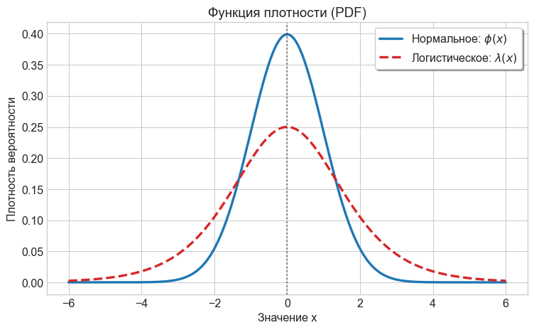
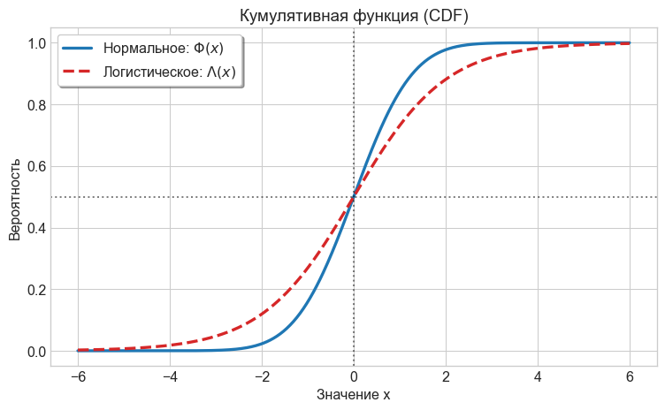
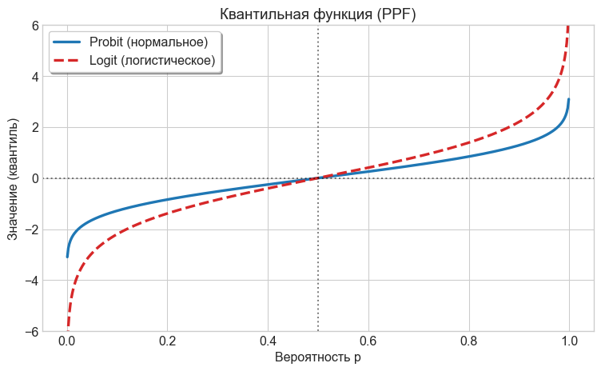
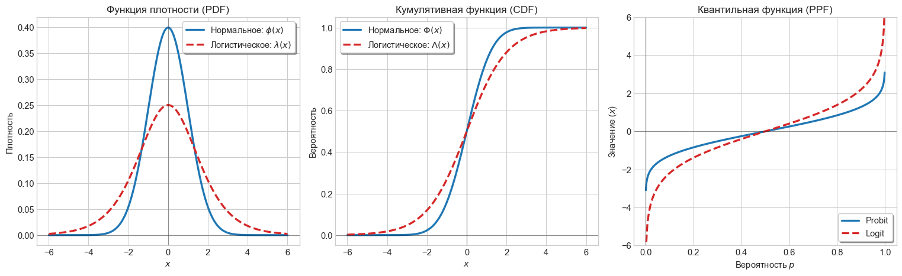

# Задачи по Эконометрике-2: logit/probit-модель
Н.В. Артамонов, А. Н. Лата (МГИМО МИД России)

- [Нормальное и логистическое
  распределения](#нормальное-и-логистическое-распределения)
- [Оценивание и интерпретация
  коэффициентов](#оценивание-и-интерпретация-коэффициентов)
  - [approve equation \#1 (probit)](#approve-equation-1-probit)
  - [approve equation \#2 (logit)](#approve-equation-2-logit)
  - [labour force equation \#1
    (probit)](#labour-force-equation-1-probit)
  - [labour force equation \#2 (logit)](#labour-force-equation-2-logit)
- [z-test](#z-test)
  - [approve equation \#1 (probit)](#approve-equation-1-probit-1)
  - [approve equation \#2 (logit)](#approve-equation-2-logit-1)
  - [labour force equation \#1
    (probit)](#labour-force-equation-1-probit-1)
  - [labour force equation \#2
    (logit)](#labour-force-equation-2-logit-1)
- [LR-тест: значимость регрессии](#lr-тест-значимость-регрессии)
  - [approve equation \#1 (probit)](#approve-equation-1-probit-2)
  - [labour force equation \#1
    (probit)](#labour-force-equation-1-probit-2)
- [LR-тест: совместная значимость](#lr-тест-совместная-значимость)
  - [labour force equation \#1
    (probit)](#labour-force-equation-1-probit-3)
    - [Гипотеза 1](#гипотеза-1)
    - [Гипотеза 2](#гипотеза-2)
- [Тест Вальда: совместная
  значимость](#тест-вальда-совместная-значимость)
  - [swiss labour force equation \#1](#swiss-labour-force-equation-1)
    - [Гипотеза 1](#гипотеза-1-1)
    - [Гипотеза 2](#гипотеза-2-1)
    - [Гипотеза 3](#гипотеза-3)

# Нормальное и логистическое распределения

**Стандартное нормальное (гауссово) распределение $N(0, 1)$**

- Плотность вероятности:
  $$\phi(t) = \frac{1}{\sqrt{2\pi}} \exp\left(-\frac{t^2}{2}\right), \quad t \in \mathbb{R}$$

- (Кумулятивная) функция распределения:
  $$\Phi(x) = \int\limits_{-\infty}^x \phi(t) \, dt, \quad x \in \mathbb{R}$$

------------------------------------------------------------------------

**Логистическое распределение**

- (Кумулятивная) функция распределения:
  $$\Lambda(x) = \frac{\exp(x)}{1 + \exp(x)}, \quad x \in \mathbb{R}$$

- Плотность вероятности:
  $$\lambda(x) = \Lambda'(x) = \frac{\exp(x)}{(1 + \exp(x))^2}, \quad x \in \mathbb{R}$$

------------------------------------------------------------------------

Плотности на одном графике

Функции распределения на одном графике

Обратные функции распределения

$$logit(p)=\Lambda^{-1}(p)=\log\frac{p}{1-p} \quad \text{ и } \quad probit(p)=\Phi^{-1}(p), \quad 0<p<1$$

Их графики

# Оценивание и интерпретация коэффициентов

## approve equation \#1 (probit)

Для датасета `loanapp` рассмотрим probit-регрессию **approve на appinc,
mortno, unem, dep, male, married, yjob, self**

Спецификация:

$$P(approve=1)=\Phi(\beta_0+\beta_1appinc+\beta_2mortno+\beta_3unem+\beta_4dep+\beta_5male+\beta_6married+\beta_7yjob+\beta_8self)$$

Альтернативная спецификация:

$$probit(P(approve=1))=\beta_0+\beta_1appinc+\beta_2mortno+\beta_3unem+\beta_4dep+\beta_5male+\beta_6married+\beta_7yjob+\beta_8self$$

Оцените модель на данных и укажите коэффициенты подогнанной модели.
**Ответ округлите до 3-х десятичных знаков.**

Ответ:

| Переменная | Оценка (MLE) |
|:-----------|-------------:|
| Intercept  |        1.142 |
| appinc     |       -0.001 |
| mortno     |        0.407 |
| unem       |       -0.031 |
| dep        |       -0.083 |
| male       |         0.02 |
| married    |        0.221 |
| yjob       |       -0.001 |
| self       |       -0.158 |

Дайте интерпретацию коэффициентам модели.

## approve equation \#2 (logit)

Для датасета `loanapp` рассмотрим logit-регрессию **approve на appinc,
mortno, unem, dep, male, married, yjob, self**

Спецификация:

$$P(approve=1)=\Lambda(\beta_0+\beta_1appinc+\beta_2mortno+\beta_3unem+\beta_4dep+\beta_5male+\beta_6married+\beta_7yjob+\beta_8self)$$

Альтернативная спецификация:

$$logit(P(approve=1))=\beta_0+\beta_1appinc+\beta_2mortno+\beta_3unem+\beta_4dep+\beta_5male+\beta_6married+\beta_7yjob+\beta_8self$$

Здесь

$$logit(P(approve=1)) = \log\frac{P(approve=1)}{1-P(approve=1)} = \log\frac{P(approve=1)}{P(approve=0)}$$

Оцените модель на данных и укажите коэффициенты подогнанной модели.
**Ответ округлите до 3-х десятичных знаков.**

Ответ:

| Переменная | Оценка (MLE) |
|:-----------|-------------:|
| Intercept  |        1.931 |
| appinc     |       -0.001 |
| mortno     |        0.787 |
| unem       |       -0.055 |
| dep        |       -0.161 |
| male       |         0.03 |
| married    |        0.425 |
| yjob       |       -0.006 |
| self       |        -0.28 |

Дайте интерпретацию коэффициентам модели.

## labour force equation \#1 (probit)

Для датасета `TableF5-1` рассмотрим probit-регрессию **LFP на WA, I(WA
\*\* 2), WE, KL6, K618, CIT, UN, np.log(FAMINC)**

Спецификация:

$$P(LFP=1)=\Phi(\beta_0+\beta_1WA+\beta_2WA^2+\beta_3WE+\beta_4KL6+\beta_5K618+\beta_6CIT+\beta_7UN+\beta_8\log(FAMINC))$$

Альтернативная спецификация:

$$probit(P(LFP=1))=\beta_0+\beta_1WA+\beta_2WA^2+\beta_3WE+\beta_4KL6+\beta_5K618+\beta_6CIT+\beta_7UN+\beta_8\log(FAMINC)$$

Оцените модель на данных и укажите коэффициенты подогнанной модели.
**Ответ округлите до 3-х десятичных знаков.**

Ответ:

| Переменная     | Оценка (MLE) |
|:---------------|-------------:|
| Intercept      |       -2.005 |
| WA             |        0.008 |
| I(WA \*\* 2)   |       -0.001 |
| WE             |        0.109 |
| KL6            |       -0.851 |
| K618           |       -0.063 |
| CIT            |       -0.128 |
| UN             |       -0.011 |
| np.log(FAMINC) |          0.2 |

Дайте интерпретацию коэффициентам модели.

## labour force equation \#2 (logit)

Для датасета `TableF5-1` рассмотрим logit-регрессию **LFP на WA, I(WA
\*\* 2), WE, KL6, K618, CIT, UN, np.log(FAMINC)**

Спецификация:

$$P(LFP=1)=\Lambda(\beta_0+\beta_1WA+\beta_2WA^2+\beta_3WE+\beta_4KL6+\beta_5K618+\beta_6CIT+\beta_7UN+\beta_8\log(FAMINC))$$

Альтернативная спецификация:

$$logit(LFP)=\beta_0+\beta_1WA+\beta_2WA^2+\beta_3WE+\beta_4KL6+\beta_5K618+\beta_6CIT+\beta_7UN+\beta_8\log(FAMINC)$$

Здесь

$$logit(P(LFP=1)) = \log\frac{P(LFP=1)}{1-P(LFP=1)} = \log\frac{P(LFP=1)}{P(LFP=0)}$$

Оцените модель на данных и укажите коэффициенты подогнанной модели.
**Ответ округлите до 3-х десятичных знаков.**

Ответ:

| Переменная     | Оценка (MLE) |
|:---------------|-------------:|
| Intercept      |       -3.241 |
| WA             |        0.007 |
| I(WA \*\* 2)   |       -0.001 |
| WE             |         0.18 |
| KL6            |       -1.414 |
| K618           |       -0.104 |
| CIT            |       -0.217 |
| UN             |       -0.018 |
| np.log(FAMINC) |        0.333 |

Дайте интерпретацию коэффициентам модели.

# z-test

## approve equation \#1 (probit)

Для датасета `loanapp` рассмотрим probit-регрессию **approve на appinc,
mortno, unem, dep, male, married, yjob, self**

Подгоните модель на данных и приведите результаты $z$-теста

Ответ:

|           |   Coef. | Std.Err. | z-value | p-value | Signif. |
|:----------|--------:|---------:|--------:|--------:|:--------|
| Intercept |  1.1418 |   0.1086 | 10.5122 |       0 |         |
| appinc    | -0.0005 |   0.0004 | -1.3752 |  0.1691 |         |
| mortno    |  0.4071 |   0.0866 |  4.7026 |       0 | \*\*\*  |
| unem      | -0.0308 |   0.0161 | -1.9086 |  0.0563 | \*      |
| dep       | -0.0828 |   0.0352 | -2.3546 |  0.0185 | \*\*    |
| male      |    0.02 |   0.0995 |  0.2009 |  0.8408 |         |
| married   |  0.2208 |   0.0865 |  2.5522 |  0.0107 | \*\*    |
| yjob      | -0.0007 |   0.0349 |   -0.02 |   0.984 |         |
| self      | -0.1583 |   0.1067 | -1.4826 |  0.1382 |         |

*Signif. codes:* `***` $p<0.01$, `**` $p<0.05$, `*` $p<0.1$

Модель была подогнана по 1971 наблюдениям.
Уровень значимости 10%

Вычислите необходимое критическое значение $z$-теста. **Ответ округлите
до 3-х десятичных знаков.**

> [!NOTE]
>
> ### Критическое значение z-теста
>
> $z_{crit} = 1.645$

Какие коэффициенты значимы?

> [!NOTE]
>
> ### Коэффициенты, значимые на уровне 10%
>
> `mortno`, `unem`, `dep`, `married`

## approve equation \#2 (logit)

Для датасета `loanapp` рассмотрим logit-регрессию **approve на appinc,
mortno, unem, dep, male, married, yjob, self**

Подгоните модель на данных и приведите результаты $z$-теста

Ответ:

|           |   Coef. | Std.Err. | z-value | p-value | Signif. |
|:----------|--------:|---------:|--------:|--------:|:--------|
| Intercept |  1.9315 |   0.1993 |  9.6891 |       0 |         |
| appinc    |  -0.001 |   0.0007 | -1.4717 |  0.1411 |         |
| mortno    |  0.7868 |   0.1721 |  4.5714 |       0 | \*\*\*  |
| unem      | -0.0549 |   0.0294 | -1.8661 |   0.062 | \*      |
| dep       | -0.1608 |   0.0647 | -2.4861 |  0.0129 | \*\*    |
| male      |    0.03 |   0.1859 |  0.1612 |  0.8719 |         |
| married   |  0.4246 |   0.1624 |  2.6145 |  0.0089 | \*\*\*  |
| yjob      | -0.0065 |   0.0651 | -0.0993 |  0.9209 |         |
| self      | -0.2804 |   0.1967 | -1.4257 |  0.1539 |         |

*Signif. codes:* `***` $p<0.01$, `**` $p<0.05$, `*` $p<0.1$

Модель была подогнана по 1971 наблюдениям.
Уровень значимости 5%

Вычислите необходимое критическое значение $z$-теста. **Ответ округлите
до 3-х десятичных знаков.**

> [!NOTE]
>
> ### Критическое значение z-теста
>
> $z_{crit} = 1.960$

Какие коэффициенты значимы?

> [!NOTE]
>
> ### Коэффициенты, значимые на уровне 5%
>
> `mortno`, `dep`, `married`

## labour force equation \#1 (probit)

Для датасета `TableF5-1` рассмотрим probit-регрессию **LFP на WA, I(WA
\*\* 2), WE, KL6, K618, CIT, UN, np.log(FAMINC)**

Подгоните модель на данных и приведите результаты z-теста

Ответ:

|                |   Coef. | Std.Err. | z-value | p-value | Signif. |
|:---------------|--------:|---------:|--------:|--------:|:--------|
| Intercept      | -2.0046 |   1.7055 | -1.1754 |  0.2398 |         |
| WA             |  0.0076 |   0.0703 |  0.1084 |  0.9137 |         |
| I(WA \*\* 2)   | -0.0005 |   0.0008 | -0.6538 |  0.5132 |         |
| WE             |  0.1088 |   0.0241 |   4.514 |       0 | \*\*\*  |
| KL6            | -0.8513 |   0.1146 | -7.4277 |       0 | \*\*\*  |
| K618           | -0.0632 |   0.0415 | -1.5206 |  0.1284 |         |
| CIT            | -0.1277 |   0.1074 | -1.1891 |  0.2344 |         |
| UN             | -0.0106 |   0.0157 | -0.6785 |  0.4975 |         |
| np.log(FAMINC) |  0.1996 |   0.1046 |  1.9081 |  0.0564 | \*      |

*Signif. codes:* `***` $p<0.01$, `**` $p<0.05$, `*` $p<0.1$

Модель была подогнана по 753 наблюдениям.
Уровень значимости 10%

Вычислите необходимое критическое значение $z$-теста. **Ответ округлите
до 3-х десятичных знаков.**

> [!NOTE]
>
> ### Критическое значение z-теста
>
> $z_{crit} = 1.645$

Какие коэффициенты значимы?

> [!NOTE]
>
> ### Коэффициенты, значимые на уровне 10%
>
> `WE`, `KL6`, `np.log(FAMINC)`

## labour force equation \#2 (logit)

Для датасета `TableF5-1` рассмотрим logit-регрессию **LFP на WA, I(WA
\*\* 2), WE, KL6, K618, CIT, UN, np.log(FAMINC)**

Подгоните модель на данных и приведите результаты $z$-теста

Ответ:

|                |   Coef. | Std.Err. | z-value | p-value | Signif. |
|:---------------|--------:|---------:|--------:|--------:|:--------|
| Intercept      | -3.2407 |   2.8337 | -1.1436 |  0.2528 |         |
| WA             |   0.007 |   0.1159 |  0.0602 |   0.952 |         |
| I(WA \*\* 2)   | -0.0008 |   0.0013 | -0.6061 |  0.5444 |         |
| WE             |    0.18 |   0.0404 |  4.4535 |       0 | \*\*\*  |
| KL6            | -1.4138 |   0.1987 | -7.1152 |       0 | \*\*\*  |
| K618           | -0.1042 |   0.0687 | -1.5166 |  0.1294 |         |
| CIT            | -0.2165 |   0.1765 | -1.2267 |  0.2199 |         |
| UN             | -0.0176 |   0.0258 | -0.6812 |  0.4957 |         |
| np.log(FAMINC) |  0.3331 |   0.1729 |  1.9272 |   0.054 | \*      |

*Signif. codes:* `***` $p<0.01$, `**` $p<0.05$, `*` $p<0.1$

Модель была подогнана по 753 наблюдениям.
Уровень значимости 5%

Вычислите необходимое критическое значение $z$-теста. **Ответ округлите
до 3-х десятичных знаков.**

> [!NOTE]
>
> ### Критическое значение z-теста
>
> $z_{crit} = 1.960$

Какие коэффициенты значимы?

> [!NOTE]
>
> ### Коэффициенты, значимые на уровне 5%
>
> `WE`, `KL6`

# LR-тест: значимость регрессии

## approve equation \#1 (probit)

Для датасета `loanapp` рассмотрим probit-регрессию **approve на appinc,
unem, male, yjob, self**

- число наблюдений: 1971
- логарифм функции правдоподобия: $\log L = -733.7270$
- логарифм функции правдоподобия для регрессии на константу:
  $\log L_{null} = -737.9793$

Тестируется значимость регрессии, т.е. гипотеза
$H_0:\beta_{appinc}=\beta_{unem}=\beta_{male}=\beta_{yjob}=\beta_{self}=0$.
Уровень значимости 10%.

Вычислите тестовую статистику. **Ответ округлите до 3-х десятичных
знаков.**

> [!NOTE]
>
> ### LR Статистика
>
> $LR = 8.505$

Вычислите критическое значение. **Ответ округлите до 3-х десятичных
знаков.**

> [!NOTE]
>
> ### Критическое значение
>
> $\chi^2_{crit} = 9.236$

> [!IMPORTANT]
>
> ### Вывод
>
> Регрессия **незначима**.

**Какие коэффициенты значимы?**

> [!NOTE]
>
> ### Коэффициенты, значимые на уровне 10%
>
> `unem`

## labour force equation \#1 (probit)

Для датасета `TableF5-1` рассмотрим несколько probit-регрессий.

| Регрессия | LR stat | Критическое значение | Значимость |
|----------:|--------:|---------------------:|:-----------|
|         1 | 105.066 |               13.362 | Значима    |
|         2 |  25.299 |                9.236 | Значима    |
|         3 |   10.44 |                7.779 | Значима    |
|         4 |    0.62 |                4.605 | Незначима  |

# LR-тест: совместная значимость

## labour force equation \#1 (probit)

Для датасета `TableF5-1` рассмотрим probit-регрессию **LFP на WA, WA
\*\* 2, WE, KL6, K618, CIT, UN, np.log(FAMINC)**

Уровень значимости 10%.

### Гипотеза 1

Тестируется значимость влияния возраста, т.е. гипотеза
$H_0:\beta_{WA}=\beta_{WA^2}=0$ по LR-тесту.

**LR-статистика:** 26.718

**Критическое значение:** 4.605

> [!TIP]
>
> ### Вывод
>
> Влияние возраста **значимо**.

### Гипотеза 2

Тестируется совместная значимость влияния **K618, CIT, UN**, т.е.
гипотеза $H_0:\beta_{K618}=\beta_{CIT}=\beta_{UN}=0$ по LR-тесту.

**LR-статистика:** 4.712

**Критическое значение:** 6.251

> [!IMPORTANT]
>
> ### Вывод
>
> Влияние переменных **незначимо**.

# Тест Вальда: совместная значимость

## swiss labour force equation \#1

Для датасета `SwissLabor` рассмотрим logit-регрессию **participation на
income, I(income \*\* 2), age, I(age \*\* 2), youngkids, oldkids,
foreign**

Оцените регрессию на данных и тестируйте следующие гипотезы, используя
$\chi^2$-статистику Вальда.

Уровень значимости 5%.

### Гипотеза 1

Тестируется значимость влияния дохода, т.е. гипотеза
$H_0:\beta_{income}=\beta_{income^2}=0$.

**Статистика Вальда:** 24.441

**P-значение:** 0.0000

**Критическое значение:** 5.991

> [!TIP]
>
> ### Вывод
>
> Влияние дохода **значимо**.

### Гипотеза 2

Тестируется значимость влияния числа детей, т.е. гипотеза
$H_0:\beta_{youngkids}=\beta_{oldkids}=0$.

**Статистика Вальда:** 48.420

**P-значение:** 0.0000

**Критическое значение:** 5.991

> [!TIP]
>
> ### Вывод
>
> Влияние числа детей **значимо**.

### Гипотеза 3

Тестируется значимость влияния возраста, т.е. гипотеза
$H_0:\beta_{age}=\beta_{age^2}=0$.

**Статистика Вальда:** 58.911

**P-значение:** 0.0000

**Критическое значение:** 5.991

> [!TIP]
>
> ### Вывод
>
> Влияние возраста **значимо**.
